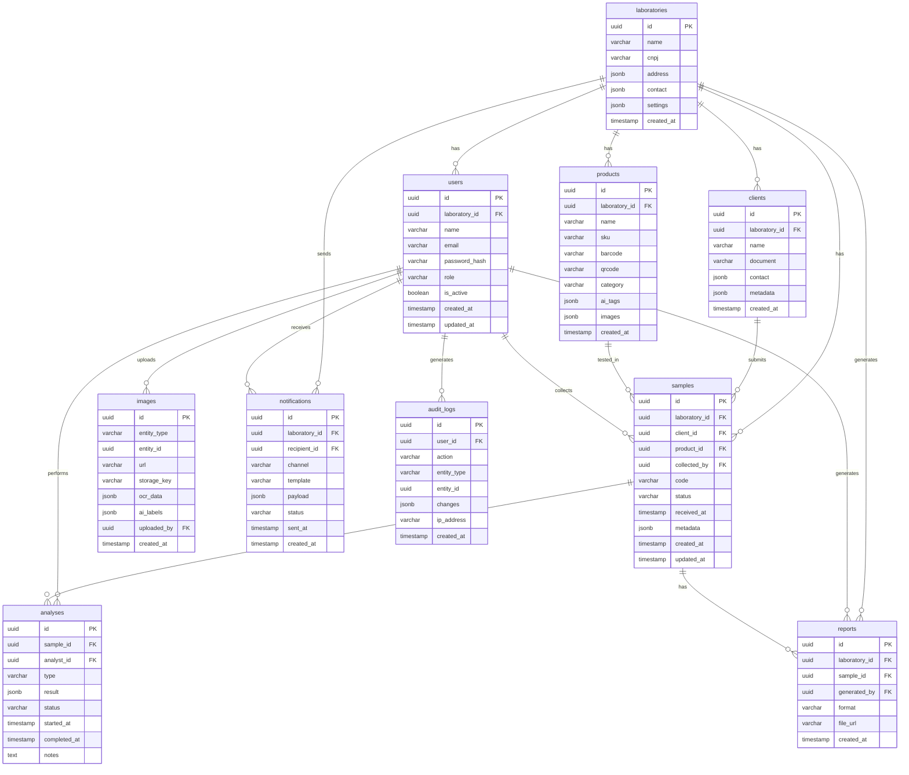

# TraceLab AI — Database ERD

> **Version:** 1.0 | **Phase:** 1 — Discovery & Architecture  
> 📐 [View interactive diagram on dbdiagram.io](https://dbdiagram.io/d) ← paste `tracelab-erd.dbml` here

---

## Entity Relationship Diagram

---

## Table Summary

| Table | Rows (estimate) | Key Indexes |
|---|---|---|
| `laboratories` | 1–100 | PK |
| `users` | 5–1,000 | `email` UNIQUE, `(lab_id, role)` |
| `clients` | 10–10,000 | `lab_id`, `(lab_id, name)` |
| `products` | 10–5,000 | `barcode`, `qrcode`, `(lab_id, sku)` |
| `samples` | 100–500,000 | `code` UNIQUE, `(lab_id, status)`, `(lab_id, received_at)` |
| `analyses` | 100–1,000,000 | `sample_id`, `(sample_id, status)` |
| `images` | 200–2,000,000 | `(entity_type, entity_id)` (polymorphic) |
| `reports` | 50–100,000 | `lab_id`, `sample_id` |
| `notifications` | 100–500,000 | `(status, created_at)` for queue processing |
| `audit_logs` | 1,000–∞ | `(entity_type, entity_id)`, `created_at` |

---

## Design Decisions

### Multi-Tenancy
All tables include `laboratory_id` FK. **Phase 1 MVP** deploys as single-tenant (one lab per instance). Row-Level Security (RLS) policies will be added in a future multi-tenant upgrade with zero schema changes.

### Polymorphic `images` Table
The `images` table uses `(entity_type, entity_id)` to attach photos to samples, products, or analyses without three separate image tables. The composite index `(entity_type, entity_id)` keeps lookups O(log n).

### Audit Logs
`audit_logs` is **append-only** — no UPDATE or DELETE queries should ever run against this table. Enforced at the application layer via NestJS guards. Required for LGPD compliance.

### JSONB Fields
Flexible `JSONB` columns (`metadata`, `result`, `ai_labels`, `ocr_data`, `contact`) avoid premature schema lock-in for domain-specific data that varies per lab type.

### PostgreSQL Extensions
Pre-enabled in `infra/docker/postgres/init.sql`:
- `uuid-ossp` — for `uuid_generate_v4()` default values
- `pg_trgm` — enables fuzzy text search on product names / sample codes
- `btree_gin` — GIN indexes for composite JSONB queries
