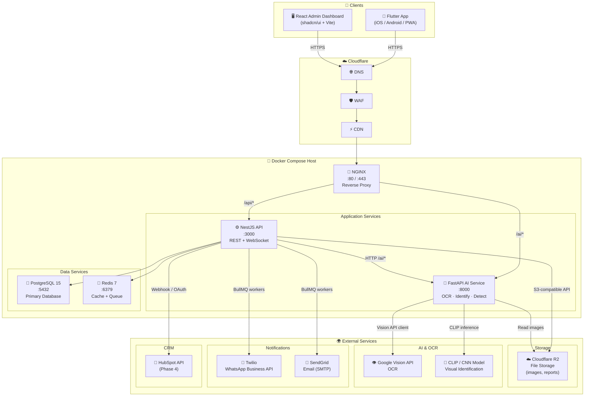

# TraceLab AI — Infrastructure Diagram

> **Version:** 1.0 | **Phase:** 1 — Discovery & Architecture  
> **Infrastructure model:** Docker Compose (all environments)  
> **Storage:** Cloudflare R2 | **OCR:** Google Vision API | **CRM:** HubSpot

---

## Full Architecture Diagram



---

## Service Catalog

| Service | Image | Port | Role |
|---|---|---|---|
| **NGINX** | `nginx:1.25-alpine` | 80, 443 | Reverse proxy, SSL termination, static serving |
| **NestJS API** | Custom (Node 20) | 3000 | Business logic, REST API, WebSocket, queues |
| **FastAPI AI** | Custom (Python 3.11) | 8000 | OCR, visual ID, defect detection |
| **PostgreSQL** | `postgres:15-alpine` | 5432 | Primary relational database |
| **Redis** | `redis:7-alpine` | 6379 | Cache (queries), queue (BullMQ for notifications) |
| **Adminer** *(dev tool)* | `adminer:4` | 8080 | Database GUI (optional profile) |

---

## Network & Data Flow

### Request Flow (sample registration)
```
Flutter App
  → HTTPS → Cloudflare (DNS + WAF + CDN)
    → NGINX :80 (proxy_pass /api/ → NestJS :3000)
      → NestJS API
        → PostgreSQL (INSERT sample)
        → Redis (cache invalidation)
        → BullMQ → SendGrid worker (email confirmation)
        → BullMQ → Twilio worker (WhatsApp confirmation)
        → HubSpot API (push new sample event)
```

### Image Upload Flow
```
Flutter/React
  → POST /images/upload → NGINX → NestJS API
    → Validates file (type, size ≤ 10MB)
    → Uploads to Cloudflare R2 (via S3-compatible SDK)
    → Saves metadata to PostgreSQL (images table)
    → [Optional] Triggers FastAPI /ai/ocr or /ai/identify
      → FastAPI downloads from R2
      → Calls Google Vision API
      → Returns result → NestJS stores in images.ocr_data / images.ai_labels
```

### Workflow State Machine
```
received ──→ in_analysis ──→ pending_review ──→ approved ──→ archived
                                         └────→ rejected ──→ archived
```
Each transition:  
1. Validates allowed role  
2. Updates `samples.status`  
3. Writes `audit_logs` entry  
4. Enqueues notification (WhatsApp + email)

---

## Security Boundaries

| Boundary | Control |
|---|---|
| Internet → NGINX | Cloudflare WAF (DDoS, OWASP rules) |
| NGINX → Services | Internal Docker network only (no public exposure of :3000, :8000, :5432, :6379) |
| API auth | JWT access (15min) + refresh tokens (7d) |
| Authorization | RBAC guards on every endpoint |
| Data in transit | TLS 1.3 (Cloudflare terminates SSL) |
| Data at rest | Cloudflare R2 server-side encryption (AES-256), PostgreSQL volume encryption |
| Secrets | `.env` file (dev), environment variables injected at runtime (prod) |
| Audit | All write operations logged in `audit_logs` table |
| Rate limiting | 100 req/min per IP on public endpoints (NestJS throttler) |

---

## Ports Reference (Local Dev)

| URL | Service |
|---|---|
| `http://localhost` | NGINX (main entry point) |
| `http://localhost/api/*` | NestJS API (proxied) |
| `http://localhost/ai/*` | FastAPI AI (proxied) |
| `http://localhost/api-docs` | Swagger UI |
| `http://localhost:3000` | NestJS direct (dev) |
| `http://localhost:8000` | FastAPI direct (dev) |
| `http://localhost:3001` | React Dashboard (dev) |
| `http://localhost:5432` | PostgreSQL |
| `http://localhost:6379` | Redis |
| `http://localhost:8080` | Adminer (optional `--profile tools`) |

---

## Infrastructure Cost Estimate (Docker Compose on single VM)

| Component | Est. Monthly Cost |
|---|---|
| Cloud VM (4 vCPU, 8GB RAM) | $40–$80 |
| Managed PostgreSQL (optional) | $25–$50 |
| Cloudflare R2 (100GB + ops) | $5–$15 |
| Google Vision API (OCR calls) | $1.50/1,000 requests |
| Twilio WhatsApp | $0.005/message |
| SendGrid | $0–$15 |
| Cloudflare (DNS + WAF) | $0–$20 |
| **Total (small lab)** | **~$75–$180/mo** |

*Significantly cheaper than the PRD's K8s estimate ($525–$1,780). Docker Compose on a single VM is appropriate for 1–5 concurrent labs.*
